```{=html}
<style>
  body{
  font-family: "Times New Roman", Times, serif;
    line-height: 1.6;
}
  h1 {
    color: green;
    font-family: "Georgia", serif;
    font-size: 28px;
    text-align: center;
  }
  h2 {
    color: darkblue;
  }
</style>
```

# PEAR-BWS (Preference Evaluation in Agricultural Research using Best-Worst Scaling)

```{=html}

```

```{=html}
<style>
  sup {
    color: blue;
    font-size: 0.8em;  /* smaller superscript */
  }
  .affiliations {
    color: grey;
    font-size: 0.9em;  /* one size smaller than normal */
    margin-top: 0.2em;
  }
</style>
```

Anjana Bivas T, Dr. Pratheesh P Gopinath

::: affiliations
Department of Agricultural Statistics, Kerala Agricultural University
:::

**PEAR-BWS** (Preference Evaluation in Agricultural Research using Best-Worst Scaling) is a web-based application designed to support the systematic design, analysis, and interpretation of Best-Worst Scaling (BWS) experiments in agricultural research. The platform provides an integrated environment for generating experimental designs, managing BWS data across different cases, and estimating preference parameters using appropriate statistical models. By offering a user-friendly interface, PEAR-BWS enables researchers to identify what stakeholders value most and least among competing agricultural attributes, technologies, and policy options, supporting more informed and evidence-based decisions.

## What is Best-Worst Scaling (BWS) ?

Best-Worst Scaling (BWS) is a survey method introduced by Australian researcher **Jordan J. Louviere** in **1987** to assess the priorities of individuals. In BWS, respondents are asked to choose the **most preferred (best)** and **least preferred (worst)** items from a given set. BWS is a specialised approach in choice experiments that focuses on distinguishing the relative preferences of choices within a set and performing a comparative ranking of the inclinations of respondents.

One of the key strengths of BWS is its simplicity for respondents. Each BWS choice set contains three to six items, making the task cognitively manageable. Unlike traditional rating methods that require evaluating a larger number of items, BWS involves a smaller number of items in a choice set, making the respondents clearer to make decisions on their preferences and gives more reliable data.

### Three cases of BWS

BWS is divided into three variants based on the type of context and the nature of items or profiles to be evaluated. They differ in the format and focus of the choice sets.

##### **Case 1 (Object Case)**

An object case is used to determine the relative ratings or ranks of a number of discrete objects. This is the simplest form of BWS, involving a survey where subsets of the objects are created and respondents are asked to select the ‘best’ and ‘worst’ items from each set.

##### **Case 2 (Profile Case)**

The profile case focuses on evaluating preferences for profiles, which are combinations of different attribute levels. Each profile represents a single choice question, and respondents are asked to identify the most and least preferred attribute levels within that profile. This method helps determine the relative importance of attributes and their levels in shaping preferences.

##### **Case 3 (Multi-profile Case)**

The multi-profile case involves presenting respondents with several profiles at a time and asking them to identify the ‘best’ and ‘worst’ options from each choice set. Each profile represents a combination of different attribute levels. Unlike the object or profile cases, where choices are made within individual profiles or among single attributes, the multi-profile case requires respondents to make choices between entire profiles. As the name implies, respondents evaluate three or more profiles at a time in each choice set.

## Overview of PEAR-BWS

PEAR-BWS is an online platform developed using R Shiny framework to support the complete workflow of BWS studies, from experimental design to result interpretation. The application translates the core principles of BWS into an intuitive interface, enabling users to conduct preference studies without requiring advanced programming skills.

The application is accessible online at [PEAR-BWS](https://anjanabivast.shinyapps.io/PEAR-BWS/), through which users can navigate all components of the platform and perform both questionnaire development and data analysis tasks.

The app is organised into two main modules: Questionnaire Generation and Statistical Analysis. Together, these modules enable users to move seamlessly from survey construction to preference estimation and result interpretation. The detailed functionalities of each module are described in the following sections.

#### Questionnaire Generation Module

The Questionnaire Generation module focuses on the design stage of a BWS study. It provides tools for generating experimental designs for different BWS cases and for constructing balanced choice sets suitable for conducting survey. This module helps ensure statistical efficiency while minimising the cognitive burden on respondents.

#### Statistical Analysis Module

The Statistical Analysis module supports the analysis and interpretation of BWS response data. It allows users to upload and validate survey data, estimate preference models, and examine results through clear graphical and tabular outputs. By integrating these analytical tools, the module enables users to derive meaningful insights from BWS studies in a systematic manner.

::: text-center
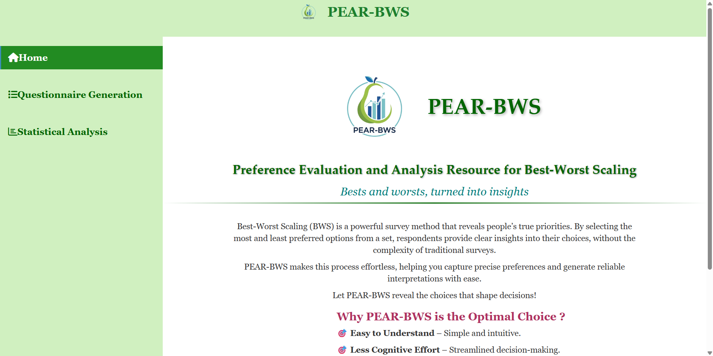{#fig-fig1}
:::

## Generation of BWS Questionnaire

The **Questionnaire Generation module** supports users in creating BWS questionnaires through a guided and structured workflow. The process begins with brief instructions that familiarise users with the BWS task, the logic behind selecting best and worst options, and the different BWS cases supported in the application (Given in **Instructions tab**). This helps users understand the method before starting questionnaire construction.

::: text-center
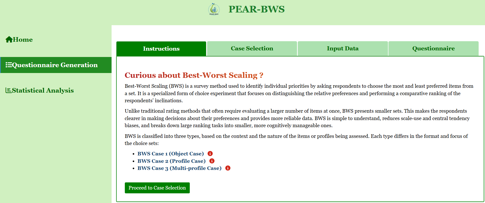{#fig-fig2}
:::

Users can select the appropriate BWS case (Object Case, Profile Case, or Multi-profile Case) from the **Case Selection tab**, based on their research objective. This selection determines the type of inputs required and the structure of the resulting questionnaire.

After selecting the case, users can provide the required data in the **Input Data tab**. For Case 1, this involves entering a list of items to be evaluated (@fig-fig3). For Cases 2 and 3, users define attributes and their corresponding levels (@fig-fig4). The application provides clear prompts and validation messages to ensure that minimum requirements are met before proceeding.

::: text-center
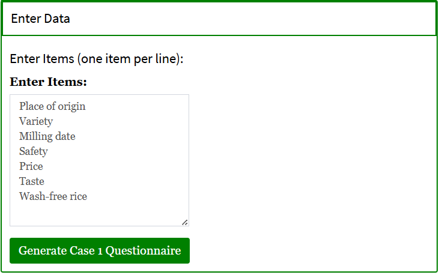{#fig-fig3 width="500px"}
:::

::: text-center
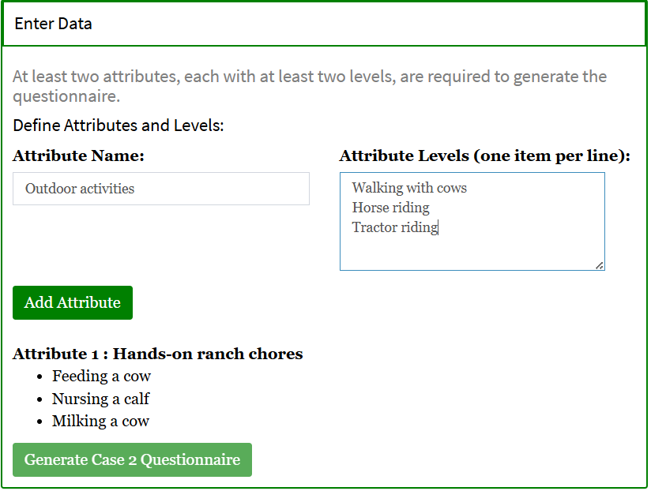{#fig-fig4 width="500px"}
:::

Once valid inputs are provided, the application automatically generates BWS choice sets using appropriate experimental design principles. For Case 1, balanced item combinations are created using Balanced Incomplete Block Designs (BIBD); for Case 2, Orthogonal Array (OA) designs are used to generate profiles from attribute–level combinations; and in Case 3, the application combines OA-based profile generation with BIBD-based choice set construction, enabling the evaluation of multiple full profiles within each choice set. The generated questionnaires are displayed in the **Questionnaire tab** exactly as respondents would see them, allowing users to review the choice sets.

Finally, users can download the complete questionnaire as a formatted document, ready for use in surveys (as given in @fig-fig5, @fig-fig6, and @fig-fig7). This workflow enables users to generate statistically sound BWS questionnaires efficiently, without requiring prior expertise in experimental design.

::: text-center
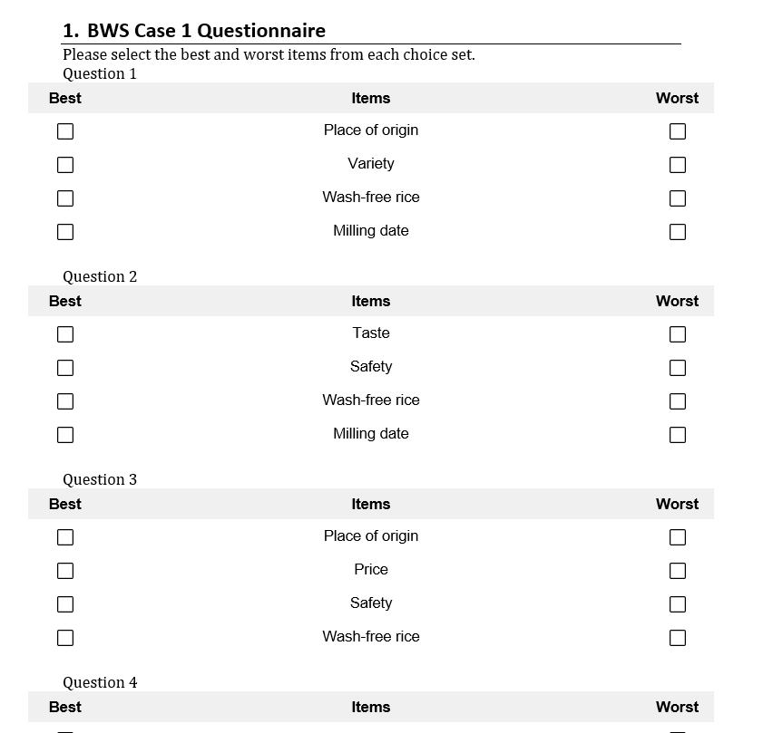{#fig-fig5 width="400px"}
:::

::: text-center
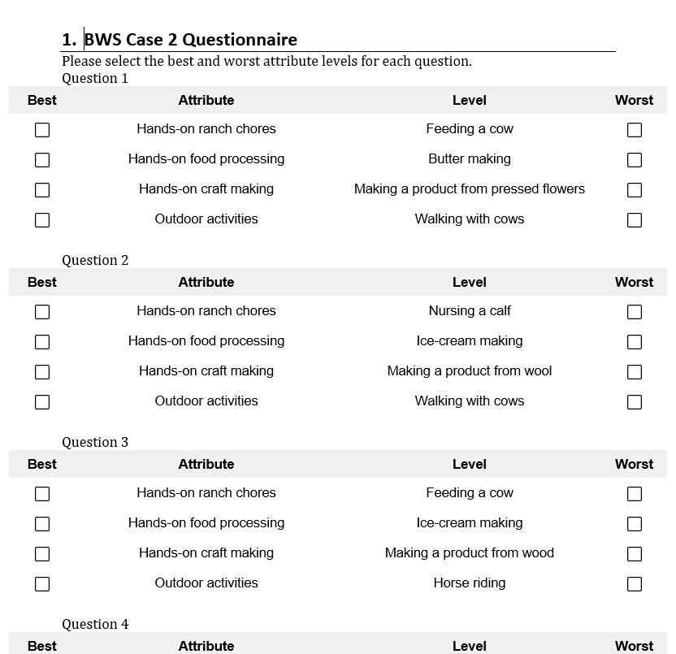{#fig-fig6 width="400px"}
:::

::: text-center
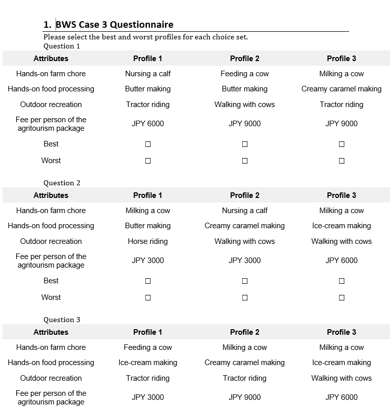{#fig-fig7 width="400px"}
:::

## Dataset Preparation for Statistical Analysis

Proper formatting of data is required for analysis using PEAR-BWS. The application provides model datasets in downloadable formats through the **Instructions tab** of the **Statistical Analysis module**, along with guidelines to organise BWS data. Separate reference datasets are provided for each BWS case to help users correctly structure their data before analysis.

The datasets should be prepared in a spreadsheet application (such as Microsoft Excel) and saved in comma-separated values (.csv) format, as PEAR-BWS accepts only CSV files for data upload.

For the Object Case (Case 1), the dataset is organised at the item level. Each row corresponds to an item evaluated by a respondent within a choice set. As illustrated in @fig-fig8, the data consist of four key variables: Respondent ID, Choice Set ID, Item, and Selection. The Selection variable is coded as 1 for the item chosen as best, −1 for the item chosen as worst, and 0 for all remaining items in the choice set. This format structure ensures that all items within each choice set are explicitly represented and is suitable for item-level preference estimation.

::: text-center
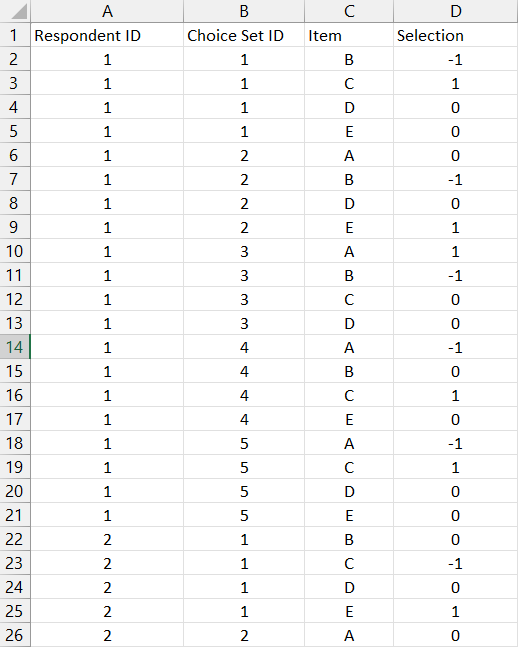{#fig-fig8}
:::

For the Profile Case (Case 2), the dataset is structured at the profile level. As illustrated by the Case 2 model dataset(@fig-fig9), the data include respondent ID, choice set ID, attribute and attribute level in each profile, and a selection variable indicating the best–worst response. The selection variable is coded as 1 for the profile chosen as best, −1 for the profile chosen as worst, and 0 for the remaining profiles within the same choice set. This format supports estimation of preferences for individual attribute levels based on the profiles selected as best and worst.

::: text-center
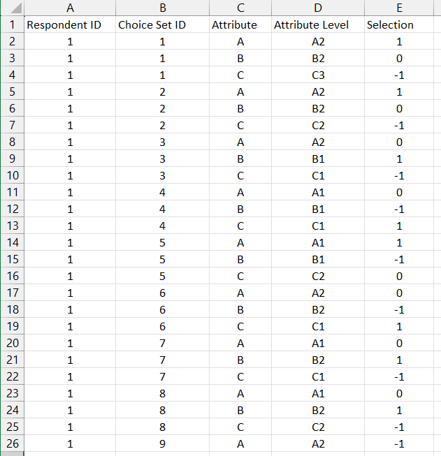{#fig-fig9 width="600px"}
:::

For the Multi-profile Case (Case 3), the dataset captures evaluations of multiple profiles within each choice set. Each row represents a profile evaluated by a respondent within a choice set, but the structure reflects the simultaneous comparison of several full profiles. As shown in @fig-fig10, the data include respondent ID, choice set ID, profile ID, along with attribute-level information defining each profile, and a selection variable indicating the best–worst response. The selection variable is coded as 1 for the profile chosen as best, −1 for the profile chosen as worst, and 0 for the remaining profiles in the same choice set. This structure captures respondent evaluations of multiple full profiles simultaneously and supports the analysis of complex trade-offs among alternative profiles.

::: text-center
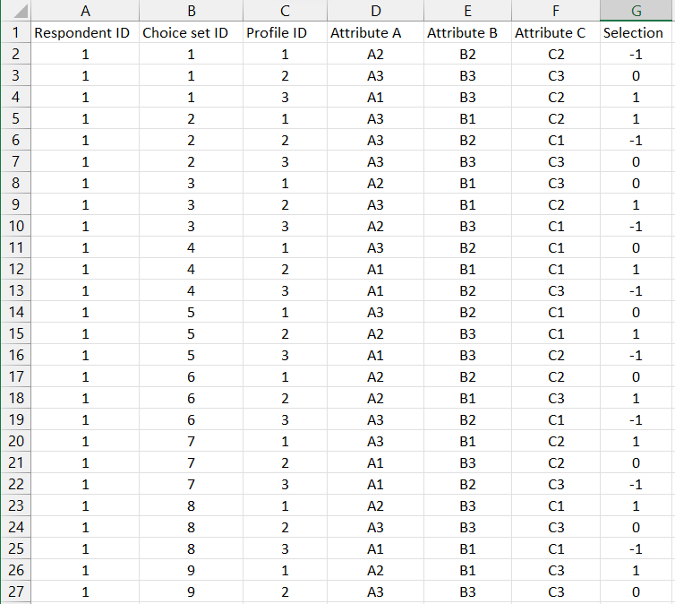{#fig-fig10 width="600px"}
:::

Across all three cases, a uniform coding scheme is used, with values of 1 for best, −1 for worst, and 0 for unselected options. This consistency ensures compatibility with the analytical procedures implemented in PEAR-BWS, including count analysis, Multinomial Logit, Hierarchical Bayes, and Latent Class models. By following these case-specific data structures, researchers can efficiently prepare their own BWS datasets and ensure reproducible and reliable analysis.

## Statistical Analysis of BWS Data

Statistical analysis is a critical step in BWS studies, as it enables the estimation and interpretation of preferences based on respondents’ best and worst choices. Once BWS response data are properly formatted, a range of analytical approaches can be applied to quantify relative importance, identify preference patterns, and explore heterogeneity among respondents. The analysis methods available in PEAR-BWS are given in the Instructions tab of the Statistical Analysis module.

PEAR-BWS supports the statistical analysis of BWS data by providing an integrated environment in which users can upload prepared datasets, apply appropriate analytical methods, and examine results in an interactive manner. The application guides users through the analysis process, beginning with data upload and validation, followed by model estimation and result visualisation.

The analysis workflow starts with importing CSV-formatted datasets corresponding to the selected BWS case. Automated validation checks are performed to verify the structure of the data, the coding of best and worst selections, and the consistency of respondent and choice set information. These checks help ensure that only valid datasets proceed to the modelling stage.

PEAR-BWS implements several widely used analytical approaches for BWS data, including count-based analysis for preliminary assessment of item importance, Multinomial Logit models, Hierarchical Bayes models, and Latent Class models. These methods allow users to estimate aggregate preferences, capture individual-level heterogeneity, and identify distinct segments of respondents with differing preference structures.

The estimated results are presented in both tabular and graphical formats, enabling users to interpret and compare preferences across items, attributes, or profiles. The following sections describe the analytical methods supported by PEAR-BWS and their implementation in detail.

### Counting method

The counting method, also referred to as count-based analysis, is one of the simplest yet effective approaches for analysing BWS data. The frequency of an item being chosen as best and worst will be calculated, using which Best-Worst score, Standard B - W score, Square Root B–W score, and Standard Square Root B–W score will be computed. Higher values of these scores indicate the stronger preference for the corresponding item.

::: {.callout-tip title="\\"}
$$
\text{B-W Score}_i = B_i - W_i
$$

$$
\text{Standard B-W Score}_i = \frac{B_i - W_i}{r \times n}
$$

$$
\text{Square Root B-W Score}_i = \sqrt{\frac{B_i}{W_i}}
$$

$$
\text{Standard Square Root B-W Score}_i =
\frac{{Square Root B-W Score}_i}{\max(Square Root B-W Scores)}
$$ {#eq-eq1}
:::

where,

-   $B_i$ denotes the number of times item *i* is selected as best
-   $W_i$ denotes the number of times item *i* is selected as worst
-   $r$ is the frequency of the item appearing in the choice sets
-   $n$ is the total number of respondents

In PEAR-BWS, count analysis can be done for BWS cases 1 and 2. Users can browse and upload the data in the prescribed format, after selecting the BWS case and analysis method. Once the data is uploaded, click on `Run Analysis` button to view the results (see @fig-fig11).

::: text-center
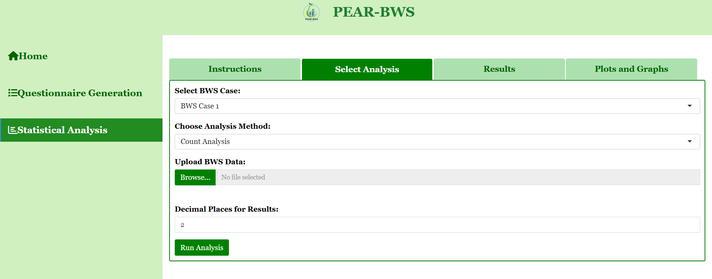{#fig-fig11 width="800px"}
:::

The B-W scores will be displayed in the **Results tab** and visualizations of the results will be available in the **Plots and Graphs tab**. The results can be downloaded as word document by clicking on the `Download Results` option.

::: text-center
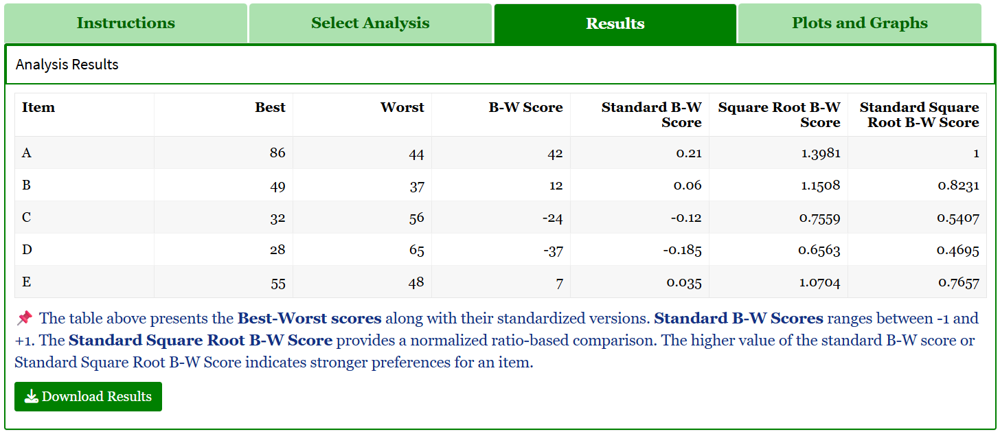{#fig-fig12 width="800px"}
:::

### Modelling methods for the profile case

In BWS Case 2, where each choice set consists of profiles defined by combinations of attribute levels, modelling methods are commonly used to capture the trade-offs respondents make among attributes. The utility of level chosen as worst is assumed to be the negative of the utility of the level chosen as best. In practice, PEAR-BWS implements three commonly used modelling approaches for Case 2 data: the paired model, the marginal model, and the marginal sequential model.

#### (i) Paired model

The paired model interprets each best–worst response as a direct comparison between the two selected levels. The level chosen as best is assumed to be preferred over the level chosen as worst, while the remaining levels in the choice set are not explicitly considered in the analysis. This model focuses on best-worst contrasts.

::: {.callout-tip title="\\"}
The probability that level $i$ is chosen as the best, and level $j$ as the worst is given by: $$
P(i,j) =
\frac{\exp\left(\upsilon_i - \upsilon_j\right)}
{\sum_{\substack{p,q \in C \\ p \neq q}}
\exp\left(\upsilon_p - \upsilon_q\right)}
$$ {#eq-eq2}
:::

where, ${\upsilon}_i$ and ${\upsilon}_i$ denote the utilities of attribute levels i and j

#### (ii) Marginal model

The marginal model makes use of information from all levels within a choice set. It models the probabilities of levels being chosen as best and as worst as separate outcomes, allowing every level in the choice set to contribute to the estimation of preference parameters.

::: {.callout-tip title="\\"}
The probability that level $i$ is chosen as the best, and level $j$ as the worst, is expressed as: $$
P(i,j) =
\frac{\exp(\upsilon_i)}{\sum_{p \in C} \exp(\upsilon_p)}
\;
\frac{\exp(-\upsilon_j)}{\sum_{p \in C} \exp(-\upsilon_p)}
$$ {#eq-eq3}
:::

#### (iii) Marginal Sequential model

The marginal sequential model assumes that respondents make their choices in two steps. First, the best level is selected from the full choice set, and then the worst level is chosen from the remaining levels. This model reflects a sequential decision process and provides an intermediate approach between the paired and marginal models.

::: {.callout-tip title="\\"}
The probability function is represented as: $$
P(i,j) =
\frac{\exp(\upsilon_i)}{\sum_{p \in C} \exp(\upsilon_p)}
\;
\frac{\exp(-\upsilon_j)}{\sum_{q \in C - i} \exp(-\upsilon_q)}
$$ {#eq-eq4}
:::

The choice of model depends on the size of the choice sets and the assumptions about respondent behaviour. The paired model is most suitable for small to medium choice sets and provides the most precise estimates by accounting for full dependency between best and worst selections. The marginal model is computationally lighter and appropriate for larger choice sets, but it assumes independence between best and worst choices. The marginal sequential model offers a middle ground, handling sequential dependencies efficiently and is useful when respondents are expected to make best and worst selections in a step-wise manner.

Users of PEAR-BWS app can select the case and modelling method to do the analysis. Data in the prescribed csv file format can be uploaded and click `Run Analysis` to obtain results.

::: text-center
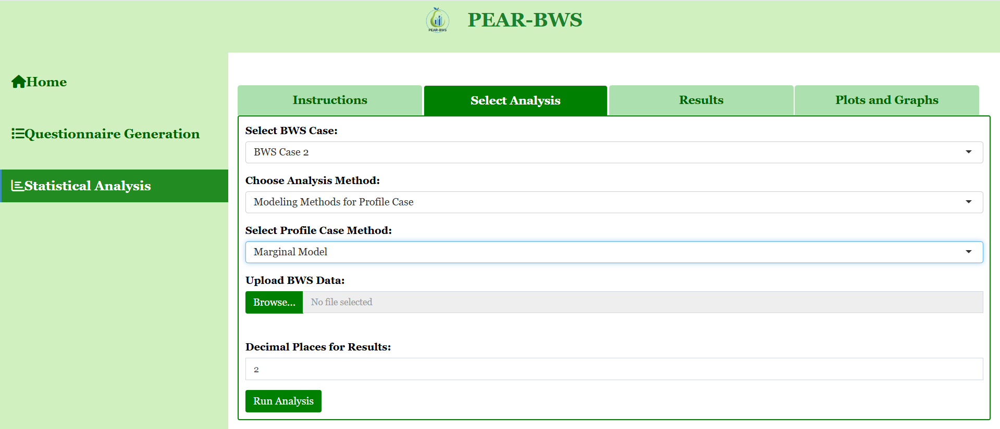{#fig-fig13 width="800px"}
:::

In all three models, the estimated coefficients represent the mean utility (preference strength) of the attribute levels. Model performance and goodness of fit are typically evaluated using log-likelihood, Akaike Information Criterion (AIC), and Bayesian Information Criterion (BIC). The log-likelihood indicates how well the model fits the observed best-worst choices, while AIC and BIC assess model adequacy by balancing goodness of fit with model complexity, thereby reflecting the parsimony and reliability of the fitted model.

::: text-center
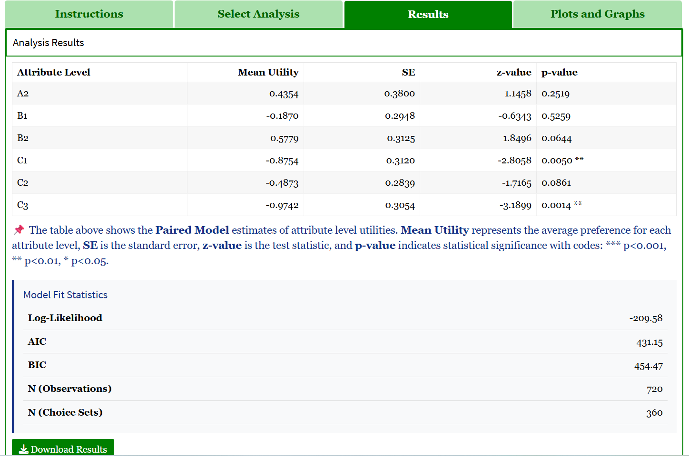{#fig-fig14 width="700px"}
:::

### Multinomial Logit (MNL) method

The Multinomial Logit model is commonly used to analyse BWS responses. The model assumes homogeneous preferences across individuals, implying that all respondents share the same underlying utility structure.

In PEAR-BWS, the MNL model is used to analyse BWS Case 1 and Case 3 data. On uploading the required data after selection of case and analysis method, the application reports utility coefficients along with their standard errors and significance tests, enabling users to interpret the direction and strength of preferences.

For Case 1, the estimated coefficients represent the relative preference for each item compared with a reference item. Items with positive coefficients are more likely to be chosen as the best, whereas negative coefficients indicate lower relative preference. After estimation, utilities are standardised so that the reference item has a value of zero, enabling direct comparison of preference strength across items. Model fit statistics, including log-likelihood, AIC, and BIC, are also reported to evaluate the adequacy of the fitted model.

::: text-center
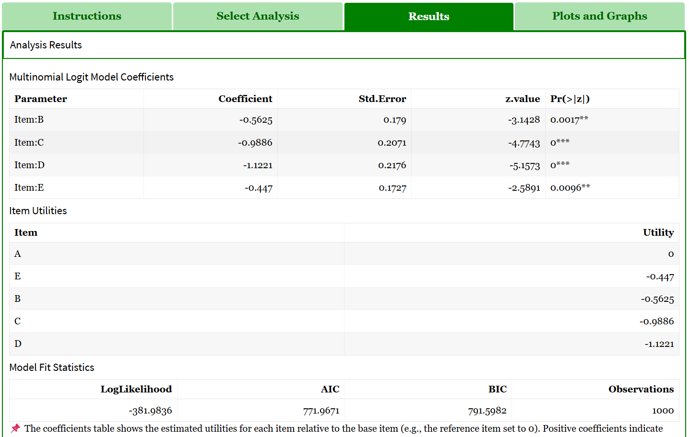{#fig-fig15 width="800px"}
:::

For Case 3, the MNL model estimates utilities for attribute levels rather than whole-profile utilities. Each coefficient reflects the contribution of a specific attribute level relative to its base level. Alternative-specific constants (ASCs) or intercepts are included to capture systematic preference differences between profiles that are not explained by observed attribute levels alone. The application additionally computes profile-level utilities by combining the estimated attribute-level effects, allowing users to compare complete profiles and identify the most preferred attribute combinations. As in Case 1, log-likelihood, AIC, and BIC are provided to assess overall model fit.

::: text-center
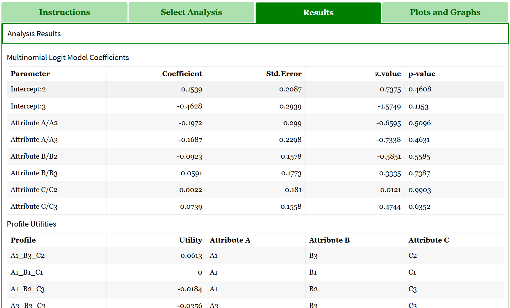{#fig-fig16 width="800px"}
:::

Overall, PEAR-BWS uses the MNL framework to provide clear interpretation of the direction and magnitude of preference effects and supports understanding of respondent choice behaviour in both object-based and multiple profiles-based BWS experiments.

### Latent Class Analysis (LCA)

Latent Class Analysis is a clustering approach used to identify preference heterogeneity among respondents in BWS data. The method assumes that respondents belong to a finite number of unobserved (latent) classes, with individuals within each class sharing similar preference structures that influence their best–worst choices.

::: {.callout-tip title="\\"}
The probability that respondent $n$ chooses alternative $j$, given latent class $s$: $$
P_{nj \mid s} =
\frac{\exp\!\left(\boldsymbol{\beta}_s\mathbf{X}_{nj}^{\prime}\right)}
{\sum_{j=1}^{J} \exp\!\left(\boldsymbol{\beta}_s\mathbf{X}_{nj}^{\prime}\right)}
$$ {#eq-eq5}
:::

where,

-   $X'_nj$ : vector of explanatory variables
-   ${\beta}_s$ : parameter vector specific to each class
-   $s$ : latent class

When LCA is selected in PEAR-BWS, the Results tab displays outcomes obtained from segmenting respondents based on their best–worst choices. The method assigns respondents to mutually exclusive latent classes, each characterised by distinct preference patterns.

LCA can be done for Cases 1 and 3. For Case 1, PEAR-BWS reports class-specific mean BWS scores for each item, enabling comparison of item preferences across respondent segments (see @fig-fig17). For Case 3, the analysis yields class-specific utilities for attribute-level combinations (profiles), allowing assessment of how preferences for attributes vary across latent classes (see @fig-fig18). In both cases, the application reports latent class proportions, indicating the relative size of each preference segment.

::: text-center
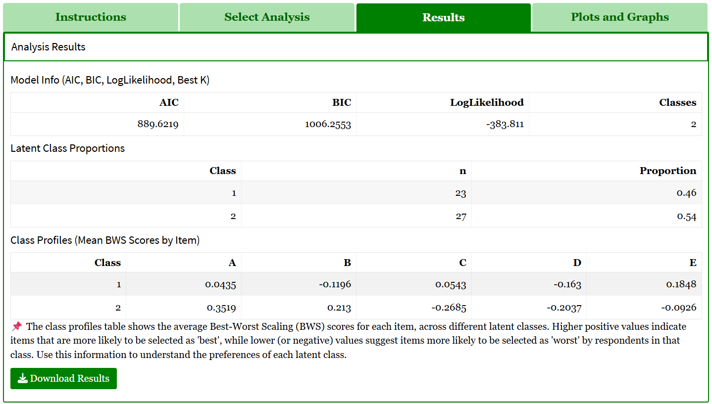{#fig-fig17 width="800px"}
:::

Model selection in LCA is guided by log-likelihood, AIC, and BIC, with the lowest information criterion considered optimal. Final results include the number of latent classes, class-specific parameter estimates, and class membership proportions, supporting a structured interpretation of preference heterogeneity in BWS data.

::: text-center
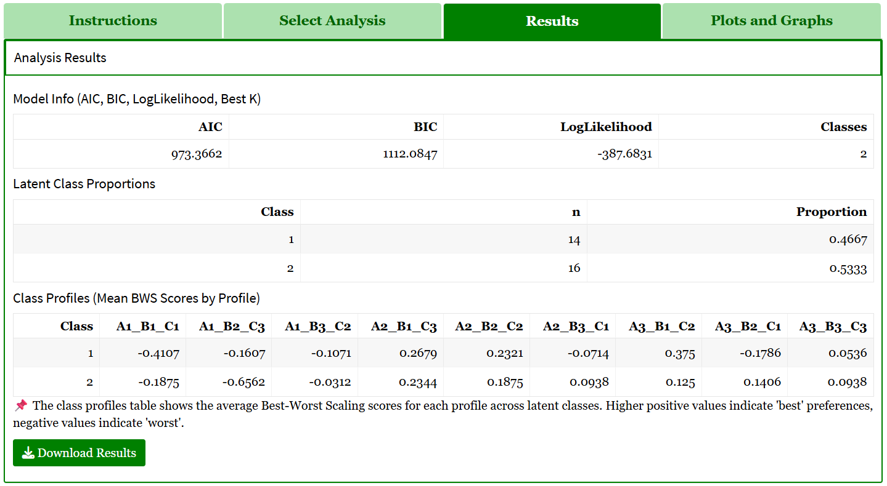{#fig-fig18 width="800px"}
:::

### Hierarchical Bayesian (HB) model

The Hierarchical Bayesian (HB) model is used to capture preference heterogeneity both within and across respondents and is particularly effective when individual-level estimates are required from limited data. The HB framework assumes that individual preferences are drawn from an underlying population distribution, thereby linking respondent-level and population-level information.

::: {.callout-tip title="\\"}
The probability that respondent $n$ selects item $i$ as best and item $j$ as worst, conditional on the individual-level parameters $\boldsymbol{\beta}_n$, is given by: $$
P(\text{best}=i,\ \text{worst}=j \mid \boldsymbol{\beta}_n)
=
\frac{\exp\left(\boldsymbol{\beta}_n \mathbf{X}_{ni}^{\prime} - \boldsymbol{\beta}_n \mathbf{X}_{nj}^{\prime}\right)}
{\sum_{\substack{i,j \in J \\ i \neq j}}
\exp\left(\boldsymbol{\beta}_n \mathbf{X}_{ni}^{\prime} - \boldsymbol{\beta}_n \mathbf{X}_{nj}^{\prime}\right)}
$$ {#eq-eq6}
:::

User can select the analysis after selecting BWS Case 1 in the Select Analysis tab and click `Run Analysis` to view results. The Results tab displays the Hierarchical Bayesian estimates of item utilities. The Mean Utility represents the posterior mean preference for each item across respondents, derived from the Bayesian estimation process. Items with higher mean utility values are more strongly preferred, while negative values indicate lower relative preference.

::: text-center
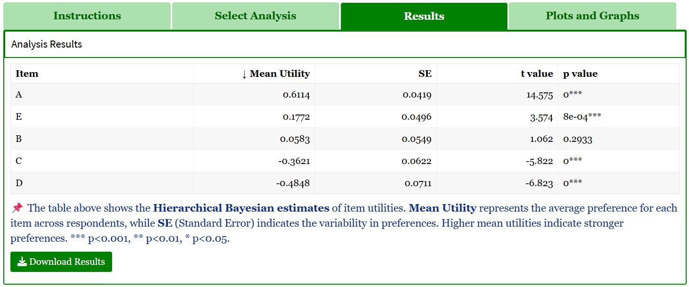{#fig-fig19 width="800px"}
:::

The HB model accounts for heterogeneity in respondent preferences by borrowing strength across individuals, resulting in stable and statistically interpretable utility estimates even with limited data.

## Results and Visualisation

The Questionnaire tab of Questionnaire Generation module displays the automatically generated BWS choice sets used for data collection. Once the data are analysed, the estimated model outputs, including utility coefficients, standard errors, significance levels, and model fit statistics, are shown in the Results tab of Statistical Analysis module.

To aid interpretation, graphical summaries of preferences and model outputs are provided in the Plots and Graphs tab. For count-based analysis, the application displays standard best-worst score plots (@fig-fig20) and item wise best-worst score plots across respondents (@fig-fig21). For model-based analysis, utility plots (@fig-fig22) are generated for the paired, marginal, marginal sequential, Hierarchical Bayesian (HB), and Multinomial Logit (MNL) models. In the case of Latent Class Analysis (LCA), class-specific plots (@fig-fig23) are provided to visualise preference heterogeneity across latent classes.

::: text-center
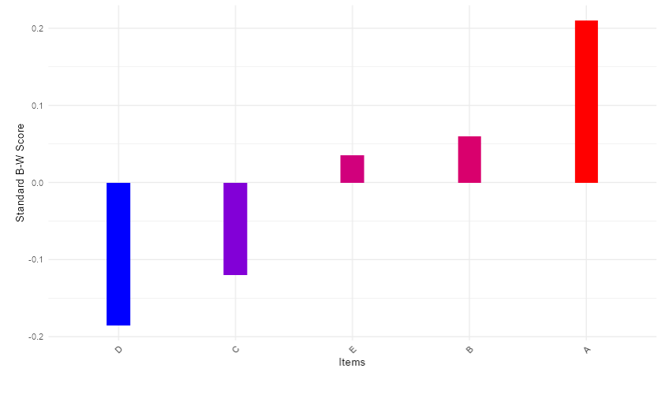{#fig-fig20 width="500px"}
:::

::: text-center
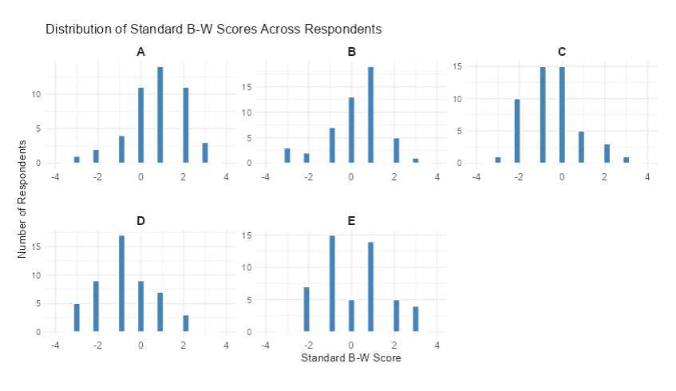{#fig-fig21 width="500px"}
:::

::: text-center
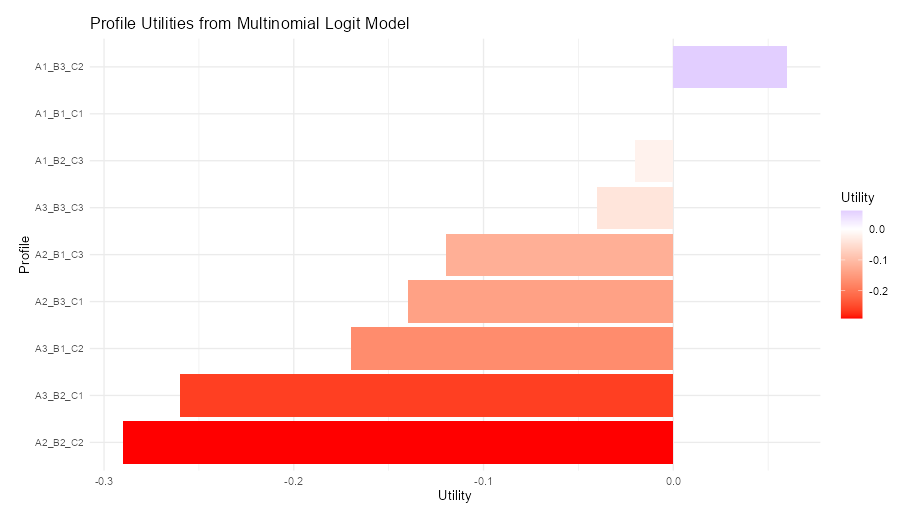{#fig-fig22 width="500px"}
:::

::: text-center
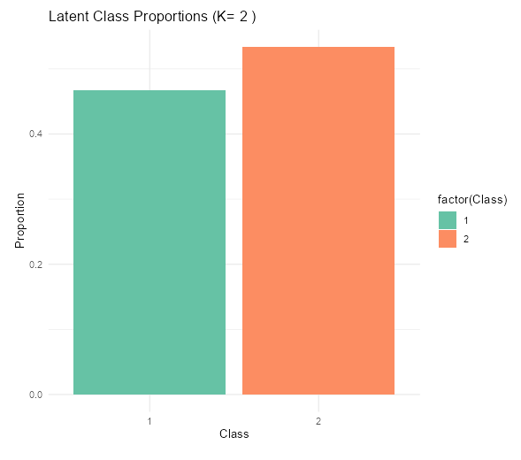{#fig-fig23 width="500px"}
:::

These visualisations help users compare items, attribute levels, profiles, or latent classes, depending on the selected BWS case and modelling approach.

For documentation and reporting purposes, all questionnaires, tables and figures produced by the application can be directly downloaded as Word documents, facilitating seamless integration into reports, presentations, and research manuscripts.
